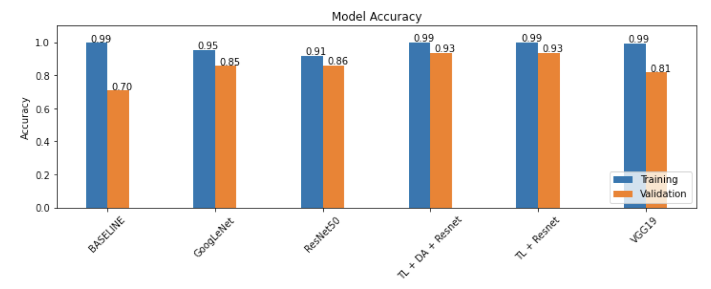

# Structural-Image-Recognition

## Introduction
It is a course project in CS230 Deep Learning at Stanford University in Fall 2020. The project is a Computer Vision topic.  Most of the work was done in CS230_Project.ipynb (originally a colab notebook). The languages and relevent packages are **Python - Tensorflow - Keras - AWS**. The project aims to classify the structural images as - None (no collapse visible), Partial (partial collapse visible), or Global (the building is fully collapsed). 
## Dataset
We used the PEER Hub Image Net, or Φ-Net, datasets for structural image recognition. There are eight Φ-Net datasets that pertain to each of eight structural image recognition classification tasks. We worked on three of these tasks - (1) identifying what part of the building is in an image, (2) identifying the extent of collapse in an image, and (3) identifying the extent of damage seen in an image - referred to by Φ-Net and in the rest of this paper as Task 1, Task 5, and Task 7, respectively.
## Model
Our ResNet-50 models were pretrained on ImageNet before being fine-tuned on our dataset. Fine- tuning was done by training only the last several model layers on our dataset. Transfer learning works well because the earlier layers of a CNN typically learn visual structures common to all images, such as edges, shapes, and colors. By using this transfer learning approach, we were able to successfully train a sophisticated models despite having small datasets. 

Our final solution for each of the three tasks was to build an ensemble of ResNets to make predictions. Ensembles are a composite of multiple neural networks, and enjoy better generalization and stability than single network architectures. We built each ensemble by stacking the five best ResNets (among tens that we tested during hyperparameter search) for each task. The output of the five layers are concatenated before being passed through a dense layer of 10 neurons and a final softmax output layer. We trained these last two layers to learn how to best combine the predictions of the five constituent models.

## Result
<figure>
  
</figure>

## Report Link
[link](http://cs230.stanford.edu/projects_fall_2020/reports/55772194.pdf)
